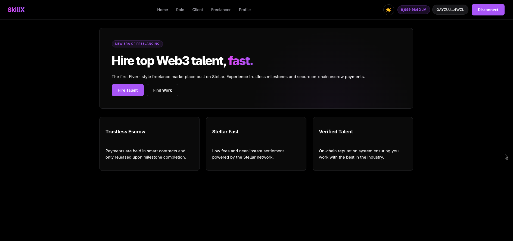
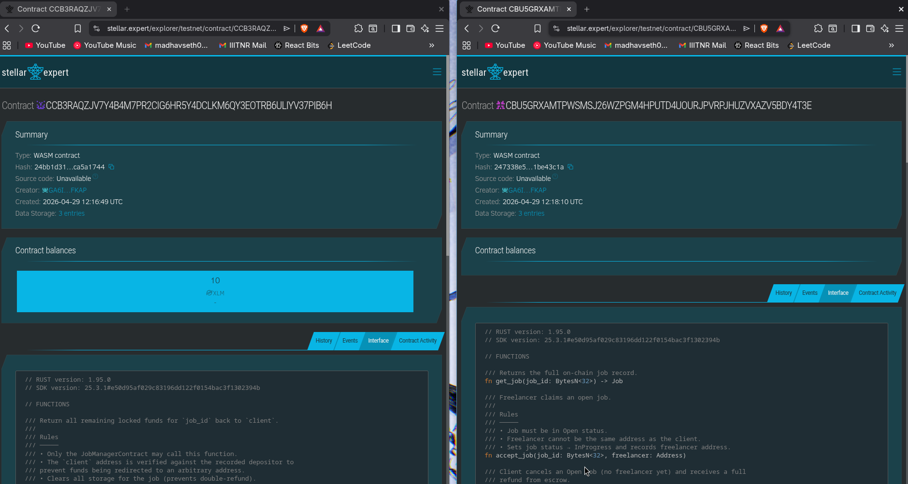

# SkillX

SkillX is a decentralized freelance marketplace on Stellar where client payments are locked in Soroban escrow and released to freelancers as milestones are completed.

Clients can create jobs, fund escrow, review milestone submissions, and release payment. Freelancers can browse jobs, accept work, submit milestones, and track payment status from the frontend.



## Level 2 Submission

SkillX targets the Stellar Journey Level 2 builder requirements: multi-wallet UX, deployed smart contracts, frontend contract calls, transaction tracking, and on-chain/off-chain state synchronization.

| Requirement | Status | Evidence |
| --- | --- | --- |
| 3 error types handled | In progress | Wallet unavailable, rejected request/signature, and insufficient balance states are documented below. |
| Contract deployed on testnet | Done | See deployed contract table. |
| Contract called from frontend | Done | `SkillX/frontend/src/services/contracts.js` and dashboard flows. |
| Transaction status visible | Done | Dashboard status messages and Stellar Expert transaction links. |
| Minimum 2+ meaningful commits | Done | Repository history includes more than 2 feature/fix commits. |
| Multi-wallet integration | In progress | Replace Freighter-only flow with StellarWalletsKit before final review. |
| Real-time event/state sync | In progress | Current app reads on-chain state and syncs UI/database; add event proof or polling proof before final review. |

## Submission Proof

| Item | Value |
| --- | --- |
| Public GitHub repository | TODO: add repository URL |
| Live demo | TODO: add Vercel/Netlify URL, optional |
| Network | Stellar Testnet |
| Verifiable transaction hash | TODO: add a real successful testnet transaction hash |
| Transaction explorer link | TODO: add `https://stellar.expert/explorer/testnet/tx/<TRANSACTION_HASH>` |

## Deployed Smart Contracts

| Alias | Contract ID | Explorer |
| --- | --- | --- |
| `escrow` | `CCB3RAQZJV7Y4B4M7PR2CIG6HR5Y4DCLKM6QY3EOTRB6ULIYV37PIB6H` | [Stellar Expert](https://stellar.expert/explorer/testnet/contract/CCB3RAQZJV7Y4B4M7PR2CIG6HR5Y4DCLKM6QY3EOTRB6ULIYV37PIB6H) |
| `job_manager` | `CBU5GRXAMTPWSMSJ26WZPGM4HPUTD4UOURJPVRPJHUZVXAZV5BDY4T3E` | [Stellar Expert](https://stellar.expert/explorer/testnet/contract/CBU5GRXAMTPWSMSJ26WZPGM4HPUTD4UOURJPVRPJHUZVXAZV5BDY4T3E) |
| `XLM Token` | `CDLZFC3SYJYDZT7K67VZ75HPJVIEUVNIXF47ZG2FB2RMQQVU2HHGCYSC` | [Native Asset Contract](https://stellar.expert/explorer/testnet/contract/CDLZFC3SYJYDZT7K67VZ75HPJVIEUVNIXF47ZG2FB2RMQQVU2HHGCYSC) |



## Screenshots

The README includes the main marketplace screen and deployed contract proof. Add the remaining Level 2 screenshots under `Images/` before final submission.

| Screenshot | File | What it should show |
| --- | --- | --- |
| Main app | `Images/main_page.png` | Marketplace/dashboard UI with wallet area visible. |
| Smart contract proof | `Images/smart_contract.png` | Deployed `escrow` and `job_manager` contracts on Stellar Expert. |
| Wallet options | `Images/wallet-options.png` | StellarWalletsKit modal with multiple wallet choices. |
| Connected wallet | `Images/wallet-connected.png` | Connected wallet address visible in the app header. |
| Profile balance | `Images/profile-balance.png` | Profile page showing testnet XLM balance. |
| Client transaction | `Images/create-job-tx.png` | Successful create job or escrow deposit with status and tx hash. |
| Freelancer transaction | `Images/freelancer-submit-tx.png` | Successful accept job or milestone submission with tx hash. |
| Payment sync | `Images/payment-sync.png` | Approved milestone/payment released and synced in the UI. |
| Error handling | `Images/error-state.png` | Wallet unavailable, rejected signature, or insufficient balance message. |

## What SkillX Includes

- `contracts/job_manager`: on-chain job lifecycle, milestone state, acceptance, submission, approval, timeout, and escrow release/refund calls.
- `contracts/escrow`: on-chain custody, deposit, milestone release, and refund logic.
- `backend`: Express and Supabase API for profiles, job metadata, milestones, and submissions.
- `frontend`: React dashboard for clients and freelancers with Stellar wallet-based contract calls.

## Contract Flow

1. Client connects a Stellar wallet.
2. Client creates a job and milestones in the app.
3. Backend stores off-chain metadata and generates deterministic hashes.
4. Frontend calls `JobManager.create_job(...)`.
5. Client funds escrow through `Escrow.deposit(...)`.
6. Freelancer accepts the job with `JobManager.accept_job(...)`.
7. Freelancer submits milestone completion with `JobManager.submit_milestone(...)`.
8. Client approves the milestone with `JobManager.approve_milestone(...)`.
9. `JobManager` calls `Escrow.release_payment(...)`.
10. Escrow transfers payment to the freelancer.

## Frontend Contract Calls

Implemented in `SkillX/frontend/src/services/contracts.js`:

- `createJobOnChain(...)`
- `acceptJobOnChain(...)`
- `submitMilestoneOnChain(...)`
- `approveMilestoneOnChain(...)`
- `depositEscrowOnChain(...)`
- `getEscrowBalanceOnChain(...)`
- `getMilestoneOnChain(...)`
- `getJobOnChain(...)`
- `getJobStatusOnChain(...)`

## Error Handling

SkillX should show clear user-facing messages for the Level 2 error cases:

| Error type | Expected behavior |
| --- | --- |
| Wallet not found | Ask the user to install or select a supported Stellar wallet. |
| User rejected request | Stop the action and show a cancelled/rejected transaction message. |
| Insufficient balance | Prevent the action and tell the user to fund their testnet wallet or escrow. |

The dashboards also surface contract configuration errors, wrong-signer errors, invalid contract IDs, failed simulations, failed submissions, and transaction timeout/failure states.

## State Synchronization

SkillX synchronizes contract state back into the UI by reading Soroban contract data after important actions:

- escrow balance checks before approval/payment
- milestone status checks before submit/approve
- job status checks after acceptance
- database refresh after successful on-chain transactions
- Stellar Expert links for manual transaction verification

For final Level 2 review, add either emitted contract events with frontend event consumption or a screenshot/video proving the current read-and-refresh synchronization flow.

## Architecture

```text
SkillX/
├── backend/
│   ├── src/
│   └── supabase-schema.sql
├── contracts/
│   ├── escrow/
│   └── job_manager/
├── frontend/
│   └── src/
└── Cargo.toml
```

### On-chain

- Job lifecycle state
- Milestone hashes and statuses
- Client/freelancer wallet addresses
- Escrow balances
- Release/refund authorization

### Off-chain

- User profiles
- Job descriptions
- Portfolio details
- Submission URLs
- UI metadata

## Local Setup

### Backend

```bash
cd SkillX/backend
cp .env.example .env
npm install
npm run dev
```

Required backend environment variables:

- `PORT`
- `SUPABASE_URL`
- `SUPABASE_SERVICE_ROLE_KEY`

Apply the database schema from:

```text
SkillX/backend/supabase-schema.sql
```

### Frontend

```bash
cd SkillX/frontend
cp .env.example .env
npm install
npm run dev
```

Required frontend environment variables:

```env
VITE_API_BASE_URL=http://localhost:4000
VITE_SOROBAN_RPC_URL=https://soroban-testnet.stellar.org
VITE_NETWORK_PASSPHRASE=Test SDF Network ; September 2015
VITE_JOB_MANAGER_CONTRACT_ID=CBU5GRXAMTPWSMSJ26WZPGM4HPUTD4UOURJPVRPJHUZVXAZV5BDY4T3E
VITE_ESCROW_CONTRACT_ID=CCB3RAQZJV7Y4B4M7PR2CIG6HR5Y4DCLKM6QY3EOTRB6ULIYV37PIB6H
```

### Contracts

```bash
cd SkillX
cargo test -p escrow
cargo test -p job_manager
```

## Backend API

- `POST /profile`
- `GET /profile/:walletAddress`
- `GET /freelancers?category=`
- `POST /job`
- `GET /job/:jobId`
- `POST /submit`
- `GET /health`

## Final Review Checklist

- [x] README includes setup instructions.
- [x] README includes deployed contract addresses.
- [x] README includes Stellar Expert contract links.
- [x] README includes smart contract screenshot.
- [x] Frontend can call deployed contracts.
- [x] UI displays transaction success/failure status.
- [x] UI displays transaction hash after successful contract actions.
- [ ] Add public GitHub repository URL.
- [ ] Add deployed live demo URL if available.
- [ ] Add a verifiable transaction hash from Stellar testnet.
- [ ] Add wallet options screenshot after StellarWalletsKit integration.
- [ ] Add connected wallet, balance, transaction, payment sync, and error screenshots.
- [ ] Commit this README and all final screenshots.

## Notes

- Keep `.env` files private.
- Do not commit private keys or seed phrases.
- Use funded Stellar testnet wallets for the client and freelancer flows.
- Use Stellar Expert links in the README so reviewers can verify the deployed contracts and transactions.
