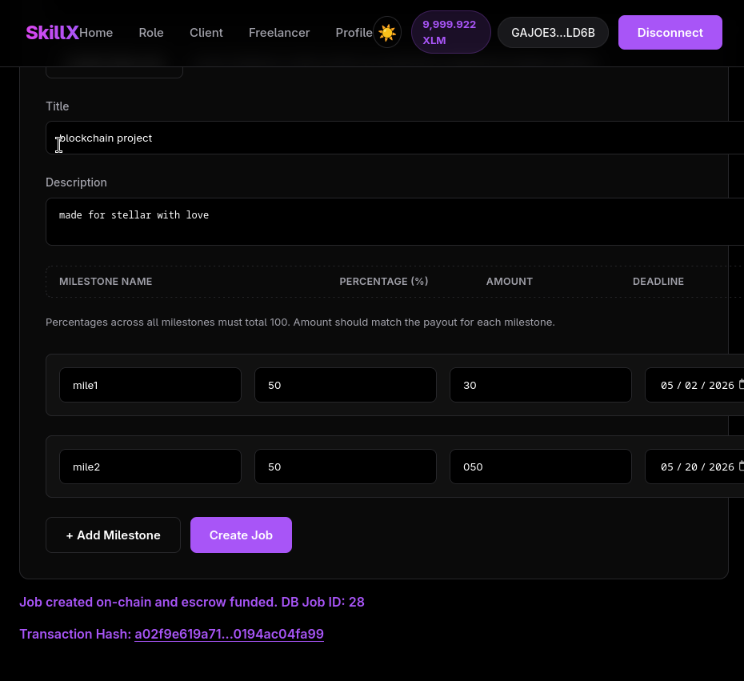

# SkillX

[](https://github.com/Madhav0Seth/SkillX/actions/workflows/ci.yml)

SkillX is a decentralized freelance marketplace on Stellar where client payments are locked in Soroban escrow and released to freelancers as milestones are completed.

Clients can create jobs, fund escrow, review milestone submissions, and release payment. Freelancers can browse jobs, accept work, submit milestones, and track payment status from the frontend.


## Live Links

| Resource | Link |
| --- | --- |
| GitHub repository | [github.com/Madhav0Seth/SkillX](https://github.com/Madhav0Seth/SkillX) |
| Live app | [skill-x-nu.vercel.app](https://skill-x-nu.vercel.app/) |
| Backend API | [skillx-tqzb.onrender.com](https://skillx-tqzb.onrender.com) |
| Health check | [skillx-tqzb.onrender.com/health](https://skillx-tqzb.onrender.com/health) |
| Demo video | [YouTube demo](https://youtu.be/GMjDWeJ5AYQ) |

## Project Highlights

- Deployed Soroban smart contracts on Stellar Testnet.
- Production frontend deployed on Vercel.
- Production backend deployed on Render.
- Client and freelancer dashboards that call contracts from the frontend.
- Escrow funding, milestone submission, approval, release, and refund flows.
- Transaction status messages and Stellar Expert transaction links in the UI.
- GitHub Actions CI for frontend build, backend sanity checks, and contract tests.
- On-chain state reads for escrow balances, jobs, milestones, and job status.
- Express and Supabase backend for off-chain profiles, jobs, milestones, and submissions.
- Freighter wallet connection, wallet identity display, and testnet XLM balance display.
- User-facing error handling for wallet connection issues, rejected requests, wrong signer, invalid contract configuration, failed simulations, failed transactions, and insufficient escrow balance.

## Deployed Smart Contracts

The deployed contracts are available on Stellar Testnet:

| Alias | Contract ID | Explorer |
| --- | --- | --- |
| `escrow` | `CCB3RAQZJV7Y4B4M7PR2CIG6HR5Y4DCLKM6QY3EOTRB6ULIYV37PIB6H` | [Stellar Expert](https://stellar.expert/explorer/testnet/contract/CCB3RAQZJV7Y4B4M7PR2CIG6HR5Y4DCLKM6QY3EOTRB6ULIYV37PIB6H) |
| `job_manager` | `CBU5GRXAMTPWSMSJ26WZPGM4HPUTD4UOURJPVRPJHUZVXAZV5BDY4T3E` | [Stellar Expert](https://stellar.expert/explorer/testnet/contract/CBU5GRXAMTPWSMSJ26WZPGM4HPUTD4UOURJPVRPJHUZVXAZV5BDY4T3E) |
| `XLM Token` | `CDLZFC3SYJYDZT7K67VZ75HPJVIEUVNIXF47ZG2FB2RMQQVU2HHGCYSC` | [Native Asset Contract](https://stellar.expert/explorer/testnet/contract/CDLZFC3SYJYDZT7K67VZ75HPJVIEUVNIXF47ZG2FB2RMQQVU2HHGCYSC) |


## Screenshots

### Marketplace


### Smart Contracts


### Job Creation Transaction



## What SkillX Includes

- `contracts/job_manager`: on-chain job lifecycle, milestone state, acceptance, submission, approval, timeout, and escrow release/refund calls.
- `contracts/escrow`: on-chain custody, deposit, milestone release, and refund logic.
- `backend`: Express and Supabase API for profiles, job metadata, milestones, and submissions.
- `frontend`: React dashboard for clients and freelancers with Stellar wallet-based contract calls.

## Contract Flow

1. Client connects a Stellar wallet.
2. Client creates a job and milestones in the app.
3. Backend stores off-chain metadata and generates deterministic hashes.
4. Frontend calls `JobManager.create_job(...)`.
5. Client funds escrow through `Escrow.deposit(...)`.
6. Freelancer accepts the job with `JobManager.accept_job(...)`.
7. Freelancer submits milestone completion with `JobManager.submit_milestone(...)`.
8. Client approves the milestone with `JobManager.approve_milestone(...)`.
9. `JobManager` calls `Escrow.release_payment(...)`.
10. Escrow transfers payment to the freelancer.

## Frontend Contract Calls

Implemented in `SkillX/frontend/src/services/contracts.js`:

- `createJobOnChain(...)`
- `acceptJobOnChain(...)`
- `submitMilestoneOnChain(...)`
- `approveMilestoneOnChain(...)`
- `depositEscrowOnChain(...)`
- `getEscrowBalanceOnChain(...)`
- `getMilestoneOnChain(...)`
- `getJobOnChain(...)`
- `getJobStatusOnChain(...)`

## Error Handling

SkillX surfaces user-facing messages for common wallet, contract, and transaction failures:

| Error type | Behavior |
| --- | --- |
| Wallet connection issue | Shows a wallet connection error and keeps the user on the connect flow. |
| Rejected wallet request or transaction | Stops the action and shows the wallet/API error message. |
| Wrong signing wallet | Blocks the contract call and asks the user to switch to the expected wallet. |
| Invalid or missing contract configuration | Shows a contract configuration error in the dashboard. |
| Failed simulation or transaction | Shows a failed transaction message and avoids marking the flow as complete. |
| Insufficient escrow balance | Checks escrow balance before approval/payment and funds the missing amount when needed. |

## State Synchronization

SkillX synchronizes contract state back into the UI by reading Soroban contract data after important actions:

- escrow balance checks before approval/payment
- milestone status checks before submit/approve
- job status checks after acceptance
- database refresh after successful on-chain transactions
- Stellar Expert links for manual transaction verification

## Architecture

```text
SkillX/
├── backend/
│   ├── src/
│   └── supabase-schema.sql
├── contracts/
│   ├── escrow/
│   └── job_manager/
├── frontend/
│   └── src/
└── Cargo.toml
```

### On-chain

- Job lifecycle state
- Milestone hashes and statuses
- Client/freelancer wallet addresses
- Escrow balances
- Release/refund authorization

### Off-chain

- User profiles
- Job descriptions
- Portfolio details
- Submission URLs
- UI metadata

## Local Setup

### Backend

```bash
cd SkillX/backend
npm install
npm run dev
```

Create `SkillX/backend/.env`:

```env
PORT=4000
SUPABASE_URL=your_supabase_project_url
SUPABASE_SERVICE_ROLE_KEY=your_supabase_service_role_key
```

Apply the database schema from:

```text
SkillX/backend/supabase-schema.sql
```

### Frontend

```bash
cd SkillX/frontend
npm install
npm run dev
```

Create `SkillX/frontend/.env`:

```env
VITE_API_BASE_URL=http://localhost:4000
VITE_SOROBAN_RPC_URL=https://soroban-testnet.stellar.org
VITE_NETWORK_PASSPHRASE=Test SDF Network ; September 2015
VITE_JOB_MANAGER_CONTRACT_ID=CBU5GRXAMTPWSMSJ26WZPGM4HPUTD4UOURJPVRPJHUZVXAZV5BDY4T3E
VITE_ESCROW_CONTRACT_ID=CCB3RAQZJV7Y4B4M7PR2CIG6HR5Y4DCLKM6QY3EOTRB6ULIYV37PIB6H
```

### Contracts

```bash
cd SkillX
cargo test -p escrow-contract
cargo test -p job-manager-contract
```

## Production Deployment

SkillX runs with the backend on Render and the frontend on Vercel.

| Service | URL |
| --- | --- |
| Frontend | [https://skill-x-nu.vercel.app/](https://skill-x-nu.vercel.app/) |
| Backend | [https://skillx-tqzb.onrender.com](https://skillx-tqzb.onrender.com) |

### Render Backend

The Render service is deployed from `SkillX/backend`.

```text
Root Directory: SkillX/backend
Build Command: npm install
Start Command: npm start
```

Set these Render environment variables:

```env
NODE_ENV=production
SUPABASE_URL=your_supabase_project_url
SUPABASE_SERVICE_ROLE_KEY=your_supabase_service_role_key
```

Health check:

```text
https://skillx-tqzb.onrender.com/health
```

### Vercel Frontend

The Vercel app is deployed from `SkillX/frontend`.

```text
Framework Preset: Vite
Root Directory: SkillX/frontend
Build Command: npm run build
Output Directory: dist
```

Set these Vercel environment variables:

```env
VITE_API_BASE_URL=https://skillx-tqzb.onrender.com
VITE_SOROBAN_RPC_URL=https://soroban-testnet.stellar.org
VITE_NETWORK_PASSPHRASE=Test SDF Network ; September 2015
VITE_JOB_MANAGER_CONTRACT_ID=CBU5GRXAMTPWSMSJ26WZPGM4HPUTD4UOURJPVRPJHUZVXAZV5BDY4T3E
VITE_ESCROW_CONTRACT_ID=CCB3RAQZJV7Y4B4M7PR2CIG6HR5Y4DCLKM6QY3EOTRB6ULIYV37PIB6H
```

## CI/CD

GitHub Actions runs the project checks on every push and pull request to `main` or `master`.

Workflow file:

```text
.github/workflows/ci.yml
```

The CI pipeline runs:

- frontend dependency install and production build
- backend dependency install and Express app import sanity check
- escrow contract tests
- job manager contract tests

CI/CD proof is available through the README badge and the [GitHub Actions workflow page](https://github.com/Madhav0Seth/SkillX/actions/workflows/ci.yml).

## Backend API

- `POST /profile`
- `GET /profile/:walletAddress`
- `GET /freelancers?category=`
- `POST /job`
- `GET /job/:jobId`
- `POST /submit`
- `GET /health`

## Verification

- [x] Live demo deployed on Vercel.
- [x] Backend API deployed on Render.
- [x] Demo video included.
- [x] README includes setup instructions.
- [x] README includes deployed contract addresses.
- [x] README includes Stellar Expert contract links.
- [x] README includes smart contract screenshot.
- [x] Frontend can call deployed contracts.
- [x] GitHub Actions CI workflow included.
- [x] UI displays transaction success/failure status.
- [x] UI displays transaction hash after successful contract actions.

## Notes

- Keep `.env` files private.
- Do not commit private keys or seed phrases.
- Use funded Stellar testnet wallets for the client and freelancer flows.
- Use Stellar Expert links in the README so reviewers can verify the deployed contracts and transactions.
