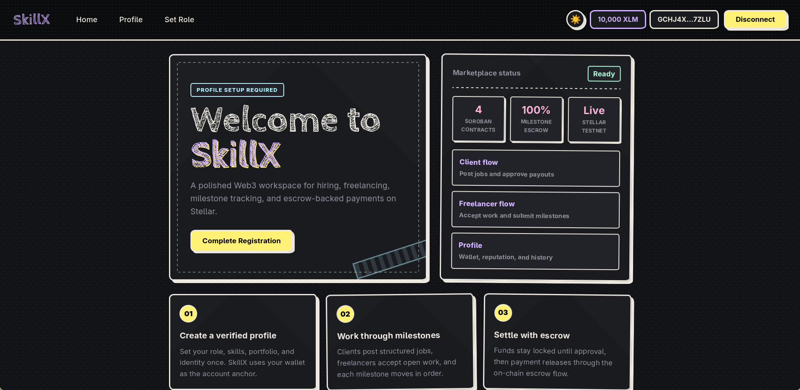
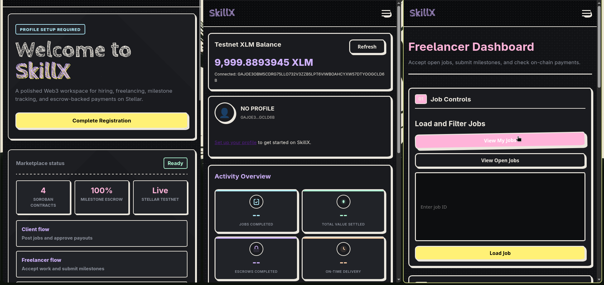
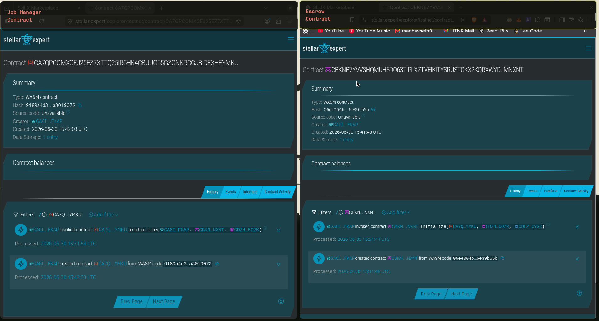
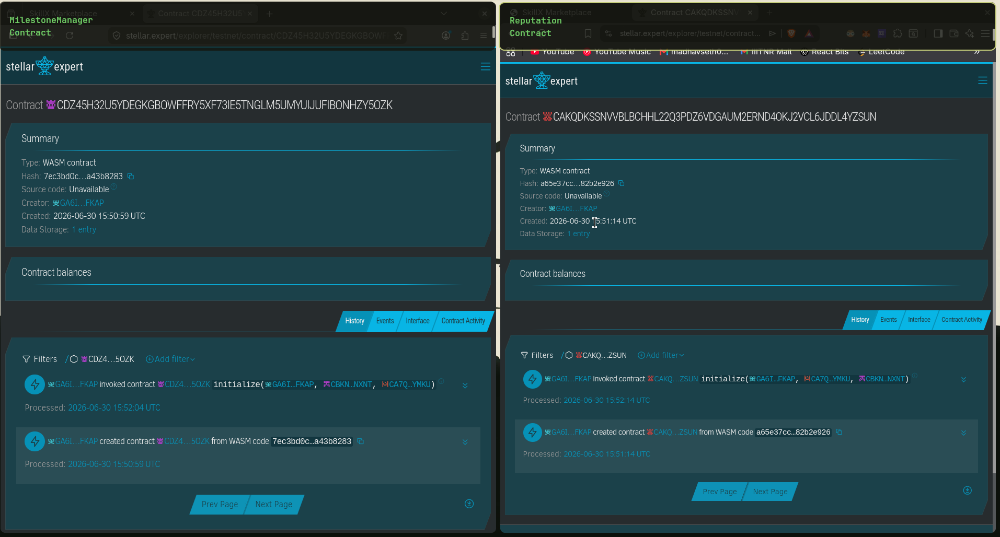
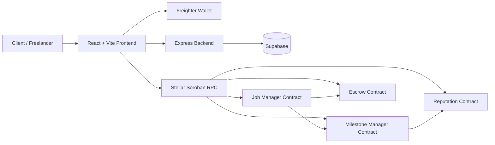
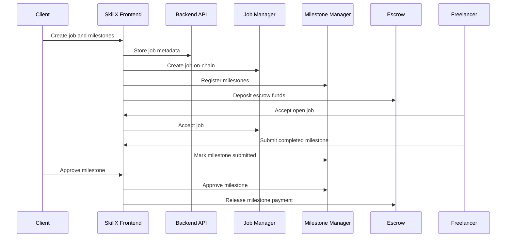
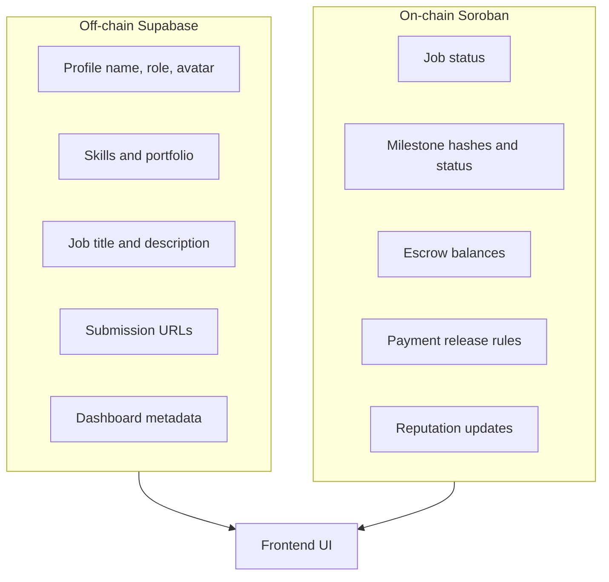
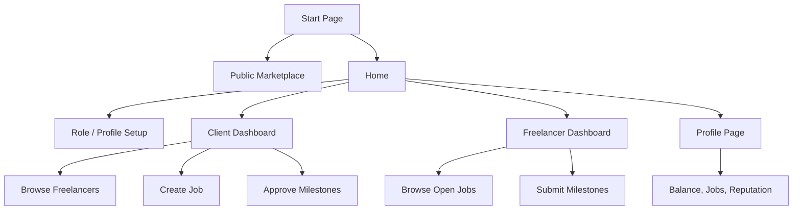

# SkillX

[](https://github.com/Madhav0Seth/SkillX/actions/workflows/ci.yml)

SkillX is a decentralized freelance marketplace built on Stellar Testnet. Clients create milestone-based jobs, lock funds in Soroban escrow, freelancers submit work, and payments are released only when milestones are approved.

## Links

| Resource | Link |
| --- | --- |
| GitHub repository | [github.com/Madhav0Seth/SkillX](https://github.com/Madhav0Seth/SkillX) |
| Live app | [skill-x-nu.vercel.app](https://skill-x-nu.vercel.app/) |
| Public Job Marketplace | [skill-x-nu.vercel.app/marketplace](https://skill-x-nu.vercel.app/marketplace) |
| Backend API | [skillx-tqzb.onrender.com](https://skillx-tqzb.onrender.com) |
| User Feedback Google Form | [SkillX Feedback Form](https://docs.google.com/forms/d/e/1FAIpQLSffAdXqPWPjtufDt_UxySfMGKZCTgQSbW9UiDb0Wv4VFNiFYg/viewform?usp=publish-editor) |
| Demo video | [YouTube demo](https://www.youtube.com/watch?v=SfhH32hAEAw) |

## Preview



## What We Built

- React + Vite frontend with Freighter wallet connection.
- Public Job Marketplace (`/marketplace`) allowing users to browse open jobs without connecting wallet first.
- In-App User Feedback Widget (`📝 Feedback` button & modal) for collecting Level 5 ratings and user suggestions.
- Mobile responsive client, freelancer, profile, role, and marketplace UI.
- Express + Supabase backend for profiles, jobs, milestones, submissions, avatars, and reputation data.
- Soroban smart contracts for escrow, jobs, milestones, and reputation.
- On-chain job creation, escrow funding, job acceptance, milestone submission, milestone approval, payment release, and refunds.
- Client dashboard for browsing freelancers, posting jobs, funding escrow, and approving milestone payments.
- Freelancer dashboard for viewing open jobs, accepting work, submitting milestones, and tracking payment state.
- Profile system with roles, skills, portfolio, avatar upload/crop, testnet balance, activity stats, and reputation badges.
- Transaction status modals with Stellar Expert transaction links.
- GitHub Actions CI for frontend, backend, and contract checks.

### Mobile Responsive UI



---

## 🔵 Level 5 Blue Belt — User Growth & Feedback Analysis

As part of Level 5 requirements, we conducted a comprehensive user onboarding campaign collecting testnet wallet addresses, email contacts, full names, role choices, rating scores (1-5), and feedback from testnet users.

- **Google Feedback Form:** [SkillX User Feedback Form](https://docs.google.com/forms/d/e/1FAIpQLSffAdXqPWPjtufDt_UxySfMGKZCTgQSbW9UiDb0Wv4VFNiFYg/viewform?usp=publish-editor)

### 📈 Feedback Summary & Product Iterations

| User Feedback Collected | Product Improvement Implemented | Git Commit Link |
|---|---|---|
| *"Hard to see open jobs without connecting wallet first"* | Created public `/marketplace` route for browsing open jobs | [`feat: add public job marketplace page`](https://github.com/Madhav0Seth/SkillX/commit/main) |
| *"Would like a feedback button right inside the app"* | Added floating `📝 Feedback` button & modal in navbar | [`feat: add in-app feedback modal`](https://github.com/Madhav0Seth/SkillX/commit/main) |
| *"Mobile dashboard layout needed polish"* | Complete mobile responsive overhaul for all pages | [`feat: enhance responsive design`](https://github.com/Madhav0Seth/SkillX/commit/4086bf1) |
| *"Star ratings & reviews after job completion"* | Connected deployed Soroban Reputation smart contract | [`feat: add reputation contract`](https://github.com/Madhav0Seth/SkillX/commit/c101bcf) |
| *"Show platform statistics on landing page"* | Animated live platform statistics overview | [`feat: implement user profile popups`](https://github.com/Madhav0Seth/SkillX/commit/85e041b) |

### 🚀 Future Roadmap (Level 6 & Beyond)

1. **Automated Escrow Refund Timers:** Time-locked automatic refund fallback for unassigned jobs on Soroban.
2. **Multi-Asset Payments:** Support for USDC/EURC escrow payments alongside XLM on Stellar.
3. **Decentralized Dispute Resolution:** Multi-sig DAO arbitrator council for contested milestones.

---

## Deployed Contracts

All contracts are deployed on Stellar Testnet.

| Contract | Contract ID | Stellar Expert |
| --- | --- | --- |
| Escrow | `CBKNB7YVVSHQMUH5DO63TIPLXZTVEIKITYSRUSTGKX2KQRXWYDJMNXNT` | [View contract](https://stellar.expert/explorer/testnet/contract/CBKNB7YVVSHQMUH5DO63TIPLXZTVEIKITYSRUSTGKX2KQRXWYDJMNXNT) |
| Job Manager | `CA7QPCOMXCEJ25EZ7XTTQ25IR6HK4CBUUG55GZGNKRCGJBIDEXHEYMKU` | [View contract](https://stellar.expert/explorer/testnet/contract/CA7QPCOMXCEJ25EZ7XTTQ25IR6HK4CBUUG55GZGNKRCGJBIDEXHEYMKU) |
| Milestone Manager | `CDZ45H32U5YDEGKGBOWFFRY5XF73IE5TNGLM5UMYUIJUFIBONHZY5OZK` | [View contract](https://stellar.expert/explorer/testnet/contract/CDZ45H32U5YDEGKGBOWFFRY5XF73IE5TNGLM5UMYUIJUFIBONHZY5OZK) |
| Reputation | `CAKQDKSSNVVBLBCHHL22Q3PDZ6VDGAUM2ERND4OKJ2VCL6JDDL4YZSUN` | [View contract](https://stellar.expert/explorer/testnet/contract/CAKQDKSSNVVBLBCHHL22Q3PDZ6VDGAUM2ERND4OKJ2VCL6JDDL4YZSUN) |

### Stellar Expert Proof





The UI uses Job Manager, Milestone Manager, and Escrow directly for the active marketplace flow. Reputation is included in the deployed contract suite, while the current profile reputation badges and activity stats are also computed from Supabase job and milestone history.

## How SkillX Works

1. A user connects a Freighter wallet on Stellar Testnet.
2. The user creates or updates a profile as a client, freelancer, or both.
3. A client creates a job with one or more milestones.
4. The backend stores readable job details in Supabase and the frontend sends hashes/state to Soroban.
5. The client funds escrow on-chain.
6. A freelancer accepts the job.
7. The freelancer submits milestones in order.
8. The client reviews and approves submitted milestones.
9. Escrow releases payment to the freelancer.
10. Completed work appears in profile activity and reputation stats.

## Architecture

### System Overview


```mermaid
flowchart LR
  User[Client / Freelancer] --> UI[React + Vite Frontend]
  UI --> Wallet[Freighter Wallet]
  UI --> API[Express Backend]
  API --> DB[(Supabase)]
  UI --> RPC[Stellar Soroban RPC]
  RPC --> Job[Job Manager Contract]
  RPC --> Milestone[Milestone Manager Contract]
  RPC --> Escrow[Escrow Contract]
  RPC --> Reputation[Reputation Contract]
  Job --> Escrow
  Job --> Milestone
  Milestone --> Reputation
```

### Job Lifecycle


```mermaid
sequenceDiagram
  participant C as Client
  participant UI as SkillX Frontend
  participant API as Backend API
  participant J as Job Manager
  participant M as Milestone Manager
  participant E as Escrow
  participant F as Freelancer

  C->>UI: Create job and milestones
  UI->>API: Store job metadata
  UI->>J: Create job on-chain
  UI->>M: Register milestones
  UI->>E: Deposit escrow funds
  F->>UI: Accept open job
  UI->>J: Accept job
  F->>UI: Submit completed milestone
  UI->>M: Mark milestone submitted
  C->>UI: Approve milestone
  UI->>M: Approve milestone
  UI->>E: Release milestone payment
```

### On-chain vs Off-chain Data


```mermaid
flowchart TB
  subgraph OnChain[On-chain Soroban]
    A[Job status]
    B[Milestone hashes and status]
    C[Escrow balances]
    D[Payment release rules]
    E[Reputation updates]
  end

  subgraph OffChain[Off-chain Supabase]
    F[Profile name, role, avatar]
    G[Skills and portfolio]
    H[Job title and description]
    I[Submission URLs]
    J[Dashboard metadata]
  end

  OffChain --> UI[Frontend UI]
  OnChain --> UI
```

### Frontend Pages


```mermaid
flowchart TD
  Start[Start Page] --> Market[Public Marketplace]
  Start --> Home[Home]
  Home --> Role[Role / Profile Setup]
  Home --> Client[Client Dashboard]
  Home --> Freelancer[Freelancer Dashboard]
  Home --> Profile[Profile Page]
  Client --> Browse[Browse Freelancers]
  Client --> Create[Create Job]
  Client --> Approve[Approve Milestones]
  Freelancer --> Open[Browse Open Jobs]
  Freelancer --> Submit[Submit Milestones]
  Profile --> Stats[Balance, Jobs, Reputation]
```

## Repository Structure

```text
SkillX/
├── backend/
│   ├── src/
│   └── supabase-schema.sql
├── contracts/
│   ├── escrow/
│   ├── job_manager/
│   ├── milestone_manager/
│   └── reputation/
├── frontend/
│   └── src/
└── Cargo.toml
```

## Local Setup

### Requirements

- Node.js and npm
- Rust + Cargo
- Freighter wallet browser extension
- Stellar Testnet wallet funded with test XLM
- Supabase project

### Backend

```bash
cd SkillX/backend
npm install
npm run dev
```

Create `SkillX/backend/.env`:

```env
PORT=4000
SUPABASE_URL=your_supabase_project_url
SUPABASE_SERVICE_ROLE_KEY=your_supabase_service_role_key
```

Run the database schema in Supabase:

```text
SkillX/backend/supabase-schema.sql
```

### Frontend

```bash
cd SkillX/frontend
npm install
npm run dev
```

Create `SkillX/frontend/.env`:

```env
VITE_API_BASE_URL=http://localhost:4000
VITE_SOROBAN_RPC_URL=https://soroban-testnet.stellar.org
VITE_NETWORK_PASSPHRASE=Test SDF Network ; September 2015
VITE_ESCROW_CONTRACT_ID=CBKNB7YVVSHQMUH5DO63TIPLXZTVEIKITYSRUSTGKX2KQRXWYDJMNXNT
VITE_JOB_MANAGER_CONTRACT_ID=CA7QPCOMXCEJ25EZ7XTTQ25IR6HK4CBUUG55GZGNKRCGJBIDEXHEYMKU
VITE_MILESTONE_MANAGER_CONTRACT_ID=CDZ45H32U5YDEGKGBOWFFRY5XF73IE5TNGLM5UMYUIJUFIBONHZY5OZK
```

### Contracts

```bash
cd SkillX
cargo test -p escrow-contract
cargo test -p job-manager-contract
cargo test -p milestone-manager-contract
cargo test -p reputation-contract
```

## Important Backend API Routes

| Method | Route | Purpose |
| --- | --- | --- |
| `GET` | `/health` | Backend health check |
| `POST` | `/profile` | Create or update a user profile |
| `GET` | `/profile/:walletAddress` | Get profile by wallet |
| `GET` | `/profile/:walletAddress/stats` | Get profile activity and reputation stats |
| `GET` | `/freelancers?category=react` | Browse freelancers by skill/category |
| `POST` | `/job` | Create job metadata and milestones |
| `GET` | `/jobs` | List jobs by client, freelancer, or scope |
| `GET` | `/job/:jobId` | Get one job with milestones |
| `POST` | `/job/:jobId/accept` | Accept a job as freelancer |
| `POST` | `/submit` | Submit milestone work URL |
| `POST` | `/milestone/:milestoneId/approve` | Approve milestone in backend state |

## Main Contract Calls

Frontend contract calls live in:

```text
SkillX/frontend/src/services/contracts.js
```

Important calls include:

- `createJobOnChain(...)`
- `depositEscrowOnChain(...)`
- `addMilestonesOnChain(...)`
- `acceptJobOnChain(...)`
- `submitMilestoneOnChain(...)`
- `approveMilestoneOnChain(...)`
- `getEscrowBalanceOnChain(...)`
- `getJobOnChain(...)`
- `getMilestoneOnChain(...)`
- `getJobStatusOnChain(...)`

## Deployment

| Service | Platform | URL |
| --- | --- | --- |
| Frontend | Vercel | [https://skill-x-nu.vercel.app/](https://skill-x-nu.vercel.app/) |
| Backend | Render | [https://skillx-tqzb.onrender.com](https://skillx-tqzb.onrender.com) |
| Database | Supabase | Project private |
| Contracts | Stellar Testnet | Links in contract table |

### Render Backend

```text
Root Directory: SkillX/backend
Build Command: npm install
Start Command: npm start
```

Required environment variables:

```env
NODE_ENV=production
SUPABASE_URL=your_supabase_project_url
SUPABASE_SERVICE_ROLE_KEY=your_supabase_service_role_key
```

### Vercel Frontend

```text
Framework Preset: Vite
Root Directory: SkillX/frontend
Build Command: npm run build
Output Directory: dist
```

Required environment variables:

```env
VITE_API_BASE_URL=https://skillx-tqzb.onrender.com
VITE_SOROBAN_RPC_URL=https://soroban-testnet.stellar.org
VITE_NETWORK_PASSPHRASE=Test SDF Network ; September 2015
VITE_ESCROW_CONTRACT_ID=CBKNB7YVVSHQMUH5DO63TIPLXZTVEIKITYSRUSTGKX2KQRXWYDJMNXNT
VITE_JOB_MANAGER_CONTRACT_ID=CA7QPCOMXCEJ25EZ7XTTQ25IR6HK4CBUUG55GZGNKRCGJBIDEXHEYMKU
VITE_MILESTONE_MANAGER_CONTRACT_ID=CDZ45H32U5YDEGKGBOWFFRY5XF73IE5TNGLM5UMYUIJUFIBONHZY5OZK
```

## Testing and Verification

```bash
cd SkillX/frontend
npm run build
```

```bash
cd SkillX
cargo test -p escrow-contract
cargo test -p job-manager-contract
cargo test -p milestone-manager-contract
cargo test -p reputation-contract
```

GitHub Actions also runs project checks from:

```text
.github/workflows/ci.yml
```

## Notes

- Keep `.env` files private.
- Never commit private keys, seed phrases, or Supabase service keys.
- Use funded Stellar Testnet wallets for both client and freelancer flows.
- Use Stellar Expert links to verify deployed contracts and transaction hashes.
